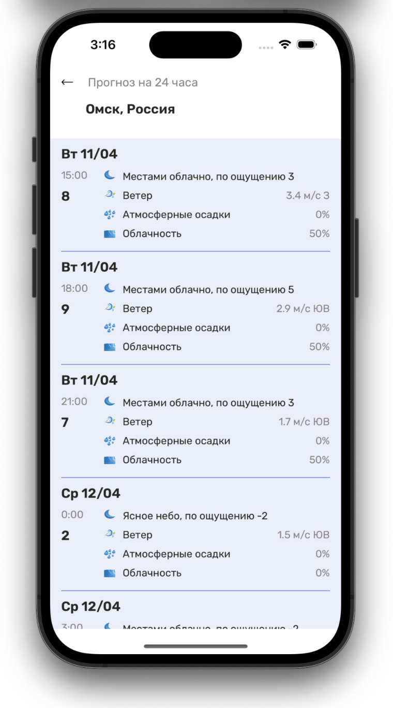

# WeatherApp

Diploma work for IOS Netology course. 

The weather forecast app is designed to display current weather conditions and forecast for different locations. User can use the device's geolocation or manually select the location of interest. The app uses geocoding to translate city names into coordinates and connects to the Yandex Weather API to retrieve weather data.

  
  
  
  
  
 

  
  
  
  
  - UIKit
  - SwiftUI (for widget)
  - Auto-Layout
  - Custom UIView's
  - UITableView, UICollectionView, and custom cells
  - UIPageController
  - Yandex Weather API
  - Yandex GEOcoder API
  - JSON parsing using Codable Protocol
  - UserDefaults
  - CoreData
  - PushNotification
  
  
